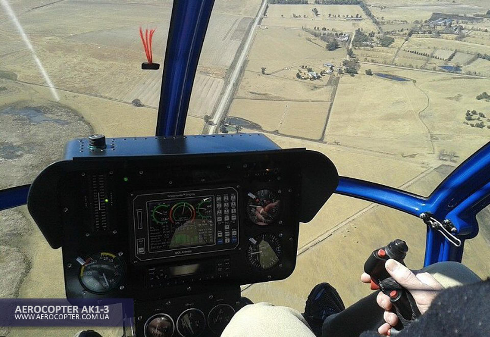

### AK1-3

The helicopter **AK1-3** was designed in **Ukraine** by aeronautics professionals with the participation of the National University of Kremenchug, after an analysis of what was being done in the world in terms of two-seater helicopters.

Everything is done in a very rational, efficient and solid way. Its design complies with international standards **JAR 27**. We are not looking for an ultra lightweight, but in a balance of efficiency and reliability.

Built since 2003 with nearly 100 units and several thousand flight hours, the **AK1-3** has proven its reliability.

The experience gained allows for good monitoring and shows that use within the limits of the flight manual makes it a very reliable machine that does not require complicated or very expensive maintenance.
The cost of the flight hour is between 170€ and 200€ depending on the number of hours stolen annually and the choice of insurance.

It is a three-bladed machine that makes it very manoeuvrable and precise, the efficiency of the rotor is surprising, associated with the **SUBARU 156 hp** engine (it sends).

The cabin is spacious with a width of 1.35 m at the shoulders, 0.20 m more than an R 22. The bubble offers a great visibility of 220°.

The dashboard is very complete and allows you to do training, the double controls are classic for each handle, you also have to appreciate the quality of the machining of the different parts.
The pre-flight inspection is easy, all points are visible without disassembly even the oil dipsticks have transparent glasses.

## MAIN FEATURES

- Main rotor diameter 6.84 m
- Number of blades 3
- Tail rotor diameter 1.29 m
- Number of blades 2
- Rotating rotor length 8.10 m
- Length without blades 5.67 m
- Width without blades 1.35 m
- Total height 2.27 m
- Maximum weight 650 Kg
- Empty weight 398 Kg
- Fuel tank capacity 72 L

## MOTORIZATION

- Subaru EJ-25, 4 cyl. water cooled
- Power 156 Hp at 5200 rpm
- Fuel SP 95
- Consumption 28 to 32 litres

## PERFORMANCES

- Maximum speed VNE 186 Km/h
- Cruising speed 160 Km/h
- Maximum climb rate 8.5 m/s
- Distance travelled (with reserve) 280 to 300 km
- Dynamic ceiling 3000 m
- Stationary (excluding ground effect) 1300 m

## OPTIONS

- Colour other than (Standard White)
- Leather seats
- Tinted windows
- Navigation lights
- Landing light
- Instrument lighting
- VHF radios Transponder


