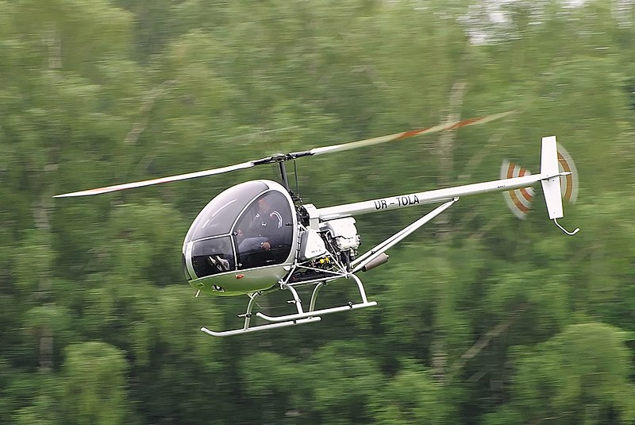

#### Ukrainian helicopter AK1-3

The **AK1-3** helicopter was designed in Ukraine by aviation specialists with the participation of the Kremenchug National University. The company "Aerokopter" exists since 1996, this year it was 23 years old.

The helicopter is effective, reliable and economical. Its design complies with international standards.

To date, more than 100 vehicles have been produced in 21 countries around the world. They have already flown several thousand hours and proved themselves perfectly both in hot countries and in countries with cold climate. 

Experience has shown that the use of the **AK1-3** in flight schools allows future pilots to quickly and effectively master the skills of piloting. The helicopter does not require complicated or very expensive maintenance. The cost of a flight hour is only about 60€ depending on the number of hours in the air. It is worth reminding that the **AK1-3** is refueled with conventional SP95 gasoline and thus allows you to reduce the cost of refueling by 4 times compared to traditional aviation fuel. Consumption is about 24-35 l.h., which is lower than its concurents in this class of helicopters (R 22 BETA II, SCHWEIZER 300C, ROTORWAY).

It is a three-blades machine that makes it very manoeuvrable, stable and extremely precise. The efficiency of the rotor is amazing. This is due to the use of the famous **SUBARU 156 hp** engine.

The spacious cabin is **1.35 m** wide by 20 cm more than the R 22. The cabine has an excellent 220° visibility.

The dashboard has all the necessary tools that allow you to train beginners.

## MAIN FEATURES

- Main rotor diameter 6.84 m
- Number of blades 3
- Tail rotor diameter 1.29 m
- Number of blades 2
- Rotating rotor length 8.10 m
- Length without blades 5.67 m
- Width without blades 1.35 m
- Total height 2.27 m
- Maximum weight 650 Kg
- Empty weight 398 Kg
- Fuel tank capacity 72 L

## MOTORIZATION

- Subaru EJ-25, 4 cyl. water cooled
- Power 156 Hp at 5200 rpm
- Fuel SP 95
- Consumption 28 to 32 litres

Inside view](003.jpg)

## PERFORMANCES

- Maximum speed VNE 186 Km/h
- Cruising speed 160 Km/h
- Maximum climb rate 8.5 m/s
- Distance travelled (with reserve) 280 to 300 km
- Dynamic ceiling 3000 m
- Stationary (excluding ground effect) 1300 m

## OPTIONS

- Colour other than (Standard White)
- Leather seats
- Tinted windows
- Navigation lights
- Landing light
- Instrument lighting
- VHF radios Transponder


