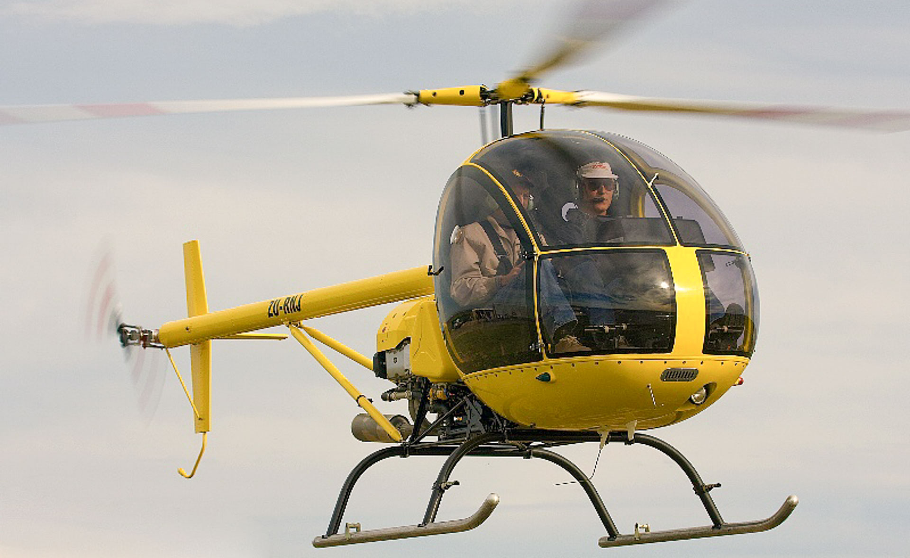
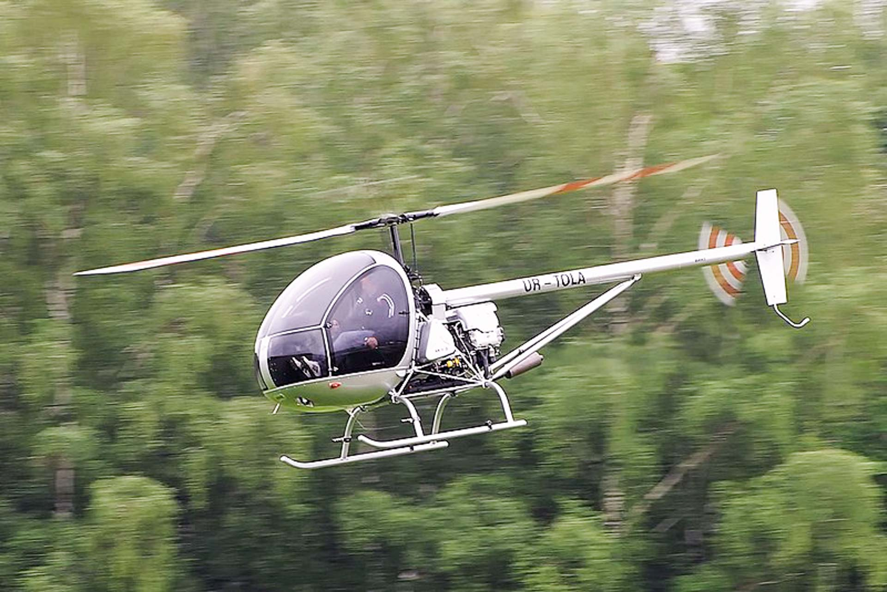
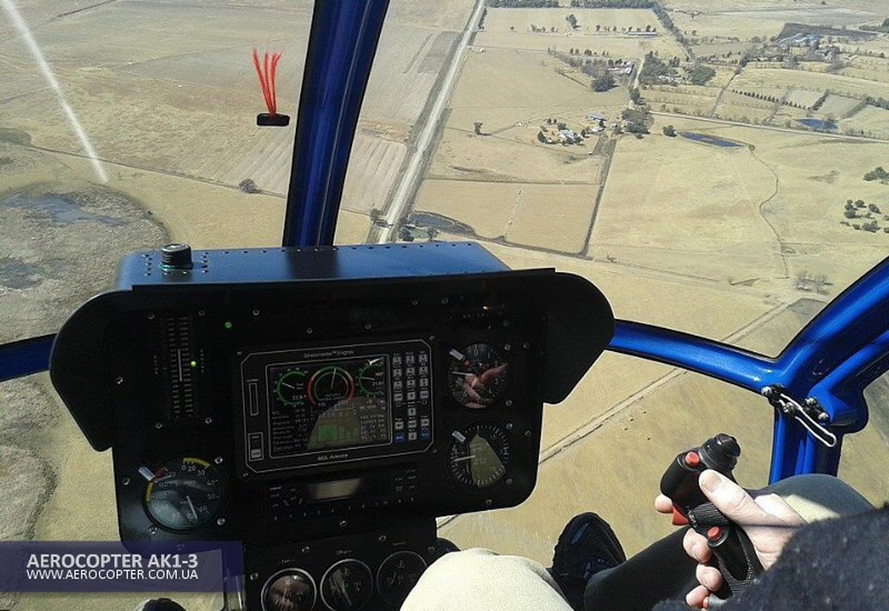

### L'hélicoptère Ukranien AK1-3

L’hélicoptère **AK1-3** a été conçu en **Ukraine** par des professionnels de l’aéronautique avec la participation de l’Université Nationale de Krementchoug, après une analyse de ce qui se faisait dans le monde en matière d’hélicoptère Biplace.

Tout est réalisé de façon très rationnelle, efficace et solide. Sa conception répond aux normes internationales **JAR 27**. Nous ne sommes pas dans la recherche d’un ultra léger, mais dans un équilibre d’efficacité et de fiabilité.

Construit depuis 2003 à bientôt 100 exemplaires et plusieurs milliers d’heures de vols, l’**AK1-3** a démontré sa fiabilité.

L’expérience acquise permet un bon suivi et démontre qu’un usage dans les limites du manuel de vol en fait une machine très fiable qui ne nécessite pas un entretien compliqué ni très couteux.
Le coût de l’heure de vol se situe entre 170€ et 200€ suivant le nombre d’heures volé annuellement et le choix de l’assurance.

C’est un tripale qui le rend très maniable et précis, l’efficacité du rotor est surprenante, associé au moteur **SUBARU 156 hp** (ça envoie).

La cabine est spacieuse 1.35 m de largeur aux épaules, 0.20 m de plus qu’un R 22. La bulle offre une visibilité formidable sur 220°.

Le tableau de bord est très complet et permet de faire de la formation.Les doubles commandes sont classiques à chacun son manche, il faut aussi apprécier la qualité de l’usinage des différentes pièces.
La visite pré vol est facile, tous les points sont visibles sans démontage même les jauges à huile ont des lunettes transparentes.

## CARACTERISTIQUES PRINCIPALES

- Diamètre rotor principal 6.84 m
- Nombre de pales 3
- Diamètre rotor de queue 1.29 m
- Nombre de pales 2
- Longueur rotor tournant 8.10 m
- Longueur sans pales 5.67 m
- Largeur sans pales 1.35 m
- Hauteur total 2.27 m
- Masse maximale 650 Kg
- Masse à vide 398 Kg
- Capacité réservoir 72 L

## MOTORISATION

- Subaru EJ-25, 4 cyl. refroidis par eau
- Puissance 156 Hp à 5200 tr/m
- Carburant SP 95
- Consommation 28 à 32 litres

## PERFORMANCES

- Vitesse maximum VNE 186 Km/h
- Vitesse de croisière 160 Km/h
- Taux de montée maximum 8.5 m/s
- Distance parcourue (avec réserve) 280 à 300   km
- Plafond dynamique 3000 m
- Stationnaire (hors effet de sol) 1300 m

## OPTIONS

- Couleur autre que (Blanc standard)
- Sièges cuir
- Vitres teintées
- Feux de navigation
- Phare d’atterrissage
- Eclairage instruments
- Radios VHF Transpondeur


