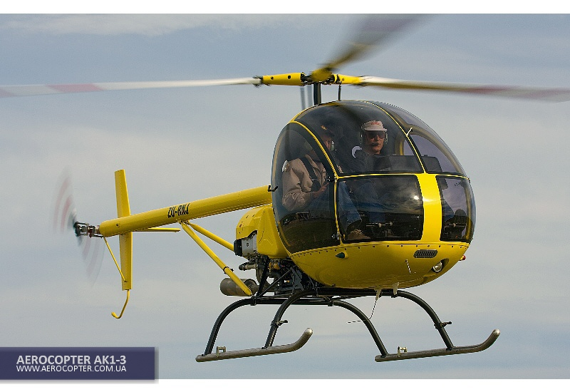
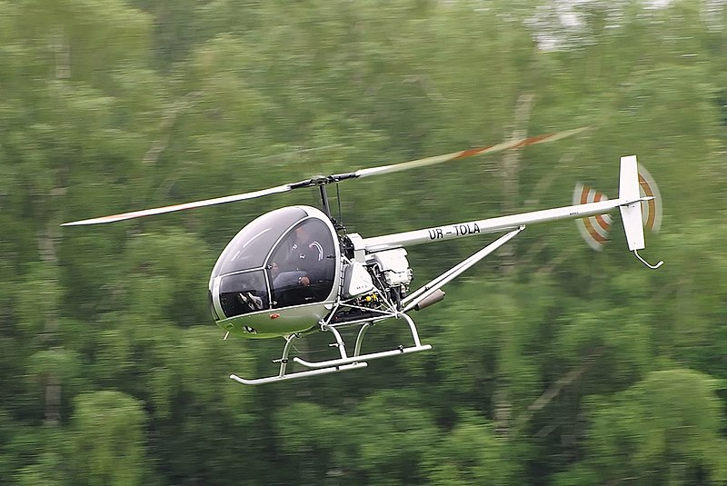
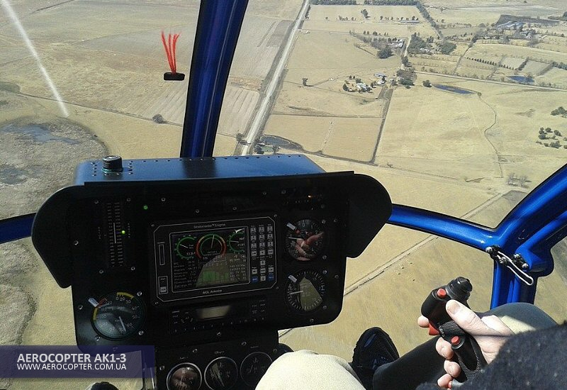

### L'hélicoptère Ukranien AK1-3

Hélicoptère ukrainien AK1-3

L'hélicoptère **AK1-3** a été conçu en Ukraine par des ingénieurs de l'aviation avec la participation de l'Université Nationale de Kremenchug. La société "Aerokopter" existe depuis 1996, cette année elle a fêté ses 23 ans.

L'hélicoptère est efficace, fiable et économique et sa conception est conforme aux normes internationales.

A ce jour, plus de **100** exemplaires volent  dans 21 pays à travers le monde. Ils ont déjà accumulé plusieurs milliers d'heures de vol et ont fait leurs preuves aussi bien dans les pays chauds que dans les pays au climat froid.

L'expérience a montré que l'utilisation de l'**AK1-3** dans les écoles de pilotage permet aux futurs pilotes de maîtriser rapidement et efficacement un hélicoptère. Il ne nécessite pas d'entretien compliqué ou très onéreux. Par exemple, le prix d'une heure de vol n'est que d'environ 60€ selon le nombre d'heures de vol. Rappelons que l'**AK1-3** est ravitaillé en essence classique SP95 et vous permet ainsi de réduire de **4** fois le coût du ravitaillement par rapport au carburant aéronautique traditionnel. La consommation est de 24-35 l.h., ce qui est inférieur par rapport à ses concurants (R 22 BETA II, SCHWEIZER 300C, ROTORWAY).

C'est une machine à trois pales qui la rend très maniable, stable et extrêmement précise. L'efficacité du rotor est étonnante. Ceci est dû à l'utilisation du célèbre moteur **SUBARU de 156 ch**.

La cabine spacieuse mesure **1,35 m** de large sur 20 cm de plus que le R 22. La cabine offre une excellente visibilité à 220°.

Le tableau de bord dispose de tous les outils nécessaires pour vous permettre de former des pilotes débutants.

## CARACTERISTIQUES PRINCIPALES

- Diamètre rotor principal 6.84 m
- Nombre de pales 3
- Diamètre rotor de queue 1.29 m
- Nombre de pales 2
- Longueur rotor tournant 8.10 m
- Longueur sans pales 5.67 m
- Largeur sans pales 1.35 m
- Hauteur total 2.27 m
- Masse maximale 650 Kg
- Masse à vide 398 Kg
- Capacité réservoir 72 L

## MOTORISATION

- Subaru EJ-25, 4 cyl. refroidis par eau
- Puissance 156 Hp à 5200 tr/m
- Carburant SP 95
- Consommation 28 à 32 litres

## PERFORMANCES

- Vitesse maximum VNE 186 Km/h
- Vitesse de croisière 160 Km/h
- Taux de montée maximum 8.5 m/s
- Distance parcourue (avec réserve) 280 à 300   km
- Plafond dynamique 3000 m
- Stationnaire (hors effet de sol) 1300 m

## OPTIONS

- Couleur autre que (Blanc standard)
- Sièges cuir
- Vitres teintées
- Feux de navigation
- Phare d’atterrissage
- Eclairage instruments
- Radios VHF Transpondeur


