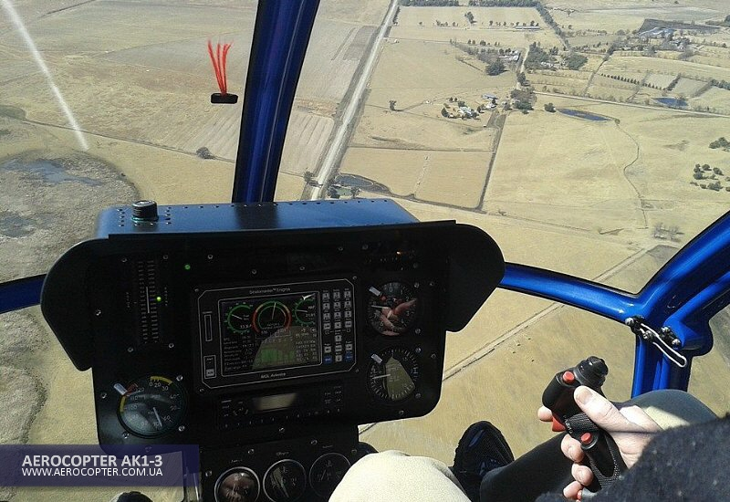

## Двухместный вертолёт АК1-3

Вертолет **АК1-3** был спроектирован в Украине специалистами авиационной отрасли при участии Кременчугского национального университета. Компания "Аэрокоптер" существует с 1996-го года, в этом году ей исполнилось 23 года.

Вертолёт эффективен, надежен и экономичен. Его конструкция соответствует международным стандартам JAR 27.

На сегодняшний день выпущено и продано более **100** машин в 21-у страну мира. Они уже налетали несколько тысяч часов и прекрасно себя зарекомендовали как в жарких странах, так и в странах с холодным климатом.

Накопленный опыт показал что использование **AK1-3** в рамках летных школ позволяет будующим пилотам быстро и эффективно овладеть навыками пилотирования.

Вертолёт не требует сложного или очень дорогостоящего технического обслуживания. Стоимость летного часа составляет всего приблизительно 60€ в зависимости от количества часов в воздухе. Стоит напомнить что **AK1-3** заправляется обычным 95-м бензином и тем самым позволяет сократить в 4 раза расход на заправку по сравнению с традиционным авиационным топливом. Расход составляет от 24-х до 35-и л.ч., что ниже по сравнению с машинами этого класса (R 22 BETA II, SCHWEIZER 300C, ROTORWAY).

**AK1-3** трехлопастная машина и позволяет ей быть маневренной, стабильной и необычайно точной. Эффективность ротора удивительна. Это связано с использованием знаменитого двигателя **SUBARU 156 л.с.**

Просторная кабина шириной 1,35 м на 20см больше, чем в R 22. Изнутри прекрасная видимость на 220°.

На приборной панели все необходимые инструменты которые позволяют проводить тренировки новичков.

Так-же вертолёт с успехом используется для частных полётов, обучении пилотов, экскурсий, перевозок грузов и в сельском хозяйстве.

## Основные характеристики AK1-3

- Диаметр главного ротора 6.84 м
- Количество лопостей 3
- Диаметр хвостового ротора 1.29 m
- Количество лопостей 2
- Длина вертолёта без лопостей 5.67 m
- Ширина вертолёта без лопостей 1.35 m
- Высота 2.27 m
- Максимальная масса 650 Kg
- Масса без загрузки 398 Kg
- Ёмкость бака 72 L

## Моторизация

- Subaru EJ-25, 4 цилиндра, водное охлаждение
- Мощность 156 л.с. при 5200 об/м
- Топливо SP 95
- Расход топлива от 28-и до 32-х литров

## Характеристики

- Максимальная скорость 186 км/ч
- Круизная скорость  160 км/ч
- Скорость подъёма 8.5 м/с
- Дальность полёта ~ 350 км
- Максимальная высота полёта 3000 м

## Дополнительные опции

- Окраска вертолёта
- Кожанные сиденья
- Тонированные стёкла
- Навигационные огни
- Посадочная фара
- Подсветка инструментальной панели
- Радио VHF с транспондером


